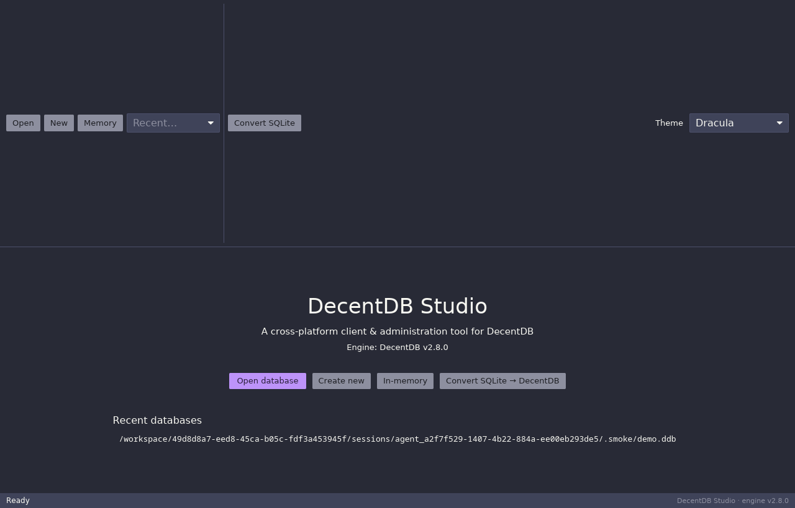
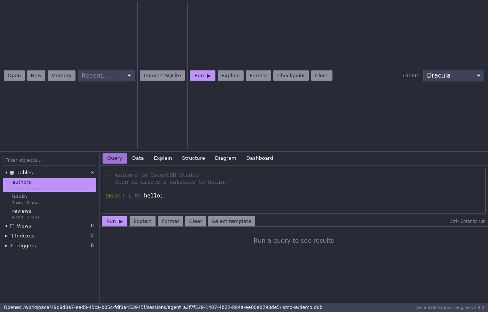
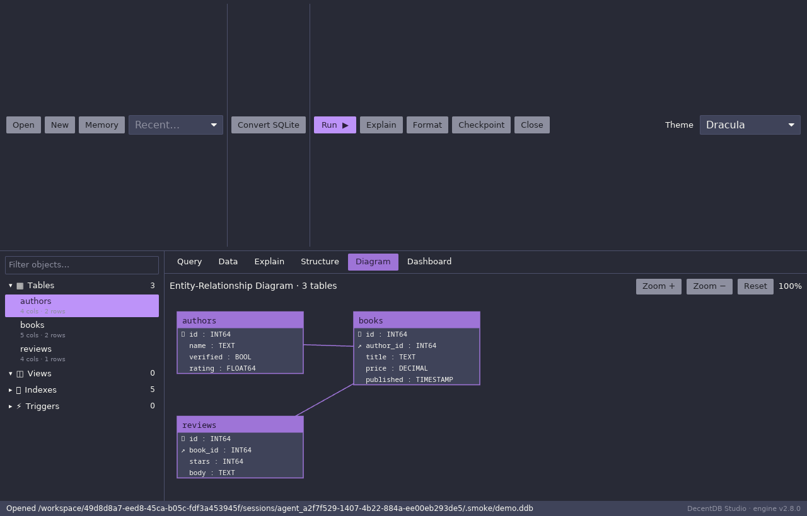
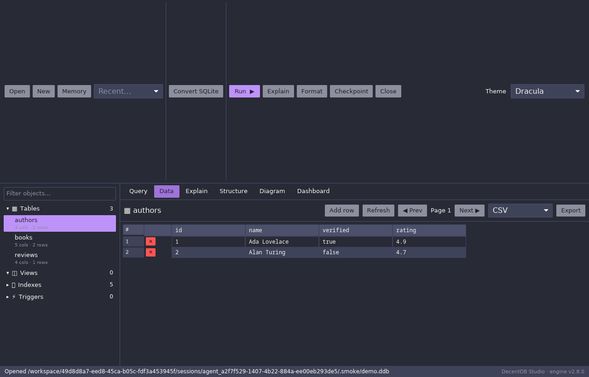
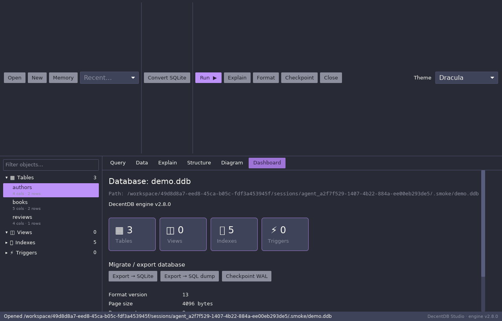

# DecentDB Studio

A cross-platform desktop client and database administration tool for the
[DecentDB](https://github.com/sphildreth/decentdb) embedded database engine —
in the spirit of DBeaver and SQL Server Management Studio, but native, fast and
written entirely in Rust.

DecentDB Studio gives you a rich SQL workbench, schema browsing, query plans,
an Entity-Relationship Diagram, inline data editing, data export, and a
one-click **SQLite → DecentDB converter** that maps SQLite affinities onto
DecentDB's full native type system.



## Features

- **Rich SQL editor** with SQL **syntax highlighting** and **interactive
  autocompletion** (keywords + live schema identifiers; click a chip to insert).
- **Multi-statement execution** — run a whole script; each statement gets its
  own result tab. `Ctrl/Cmd + Enter` runs.
- **Data browser & editor** — paginate through table rows, click any cell to
  **edit in place** (writes an `UPDATE`), **add rows**, and **delete rows**.
  Tables with a primary key are fully editable.
- **Schema explorer** — a sidebar tree of tables, views, indexes and triggers
  with a live filter, plus a **Structure** panel showing columns, keys, foreign
  keys and the object's DDL.
- **EXPLAIN plans** — view the query plan for the current statement.
- **Entity-Relationship Diagram** — auto-laid-out, pan/zoom canvas showing
  tables, columns (with PK/FK markers) and foreign-key relationships.
- **Dashboard** — engine version, storage statistics (page size/count, WAL,
  checkpoint LSN, readers) and object counts.
- **Export & migration**:
  - Export any result set or table to **CSV, JSON, Markdown or SQL `INSERT`s**.
  - Export the whole database to a **SQLite** file or a **SQL dump**.
- **SQLite → DecentDB conversion** — pick a SQLite file and rebuild it in
  DecentDB, mapping each column to the closest DecentDB native type
  (`BOOL`, `DECIMAL(p,s)`, `TIMESTAMP`, `DATE`, `TIME`, `UUID`, `BLOB`,
  `INT64`, `FLOAT64`, `TEXT`) and recreating indexes. Data is copied in batched
  transactions.
- **Slick, themeable UI** with 16 built-in themes (Tokyo Night, Dracula, Nord,
  Catppuccin, Gruvbox, Solarized, Kanagawa, Oxocarbon, Ferra, and more). Your
  theme and recent files are persisted.
- **Cross-platform** — Linux, macOS and Windows. Pure Rust, GPU-accelerated UI
  via [`iced`](https://github.com/iced-rs/iced) (wgpu, with a tiny-skia
  software fallback). SQLite support is bundled, so there is no system SQLite
  dependency.

## Screenshots

| Query + results | Entity-Relationship Diagram |
| --- | --- |
|  |  |

| Data editor | Dashboard |
| --- | --- |
|  |  |

## Building from source

### Prerequisites

- A recent stable **Rust** toolchain (`rustup`, edition 2021).
- A C toolchain and **libclang** — the DecentDB engine depends on
  `libpg_query`, whose build uses `bindgen`.

Platform notes:

- **Linux (Debian/Ubuntu):**
  ```bash
  sudo apt-get install -y build-essential pkg-config clang libclang-dev
  ```
  Runtime needs the usual desktop GL/Wayland/X11 libraries.
- **macOS:** install the Xcode command-line tools (`xcode-select --install`);
  libclang ships with them.
- **Windows:** install the MSVC build tools and LLVM (which provides
  `libclang`). Ensure `LIBCLANG_PATH` points at the LLVM `bin` directory if it
  is not auto-detected.

If `libclang` is not auto-detected, set `LIBCLANG_PATH` to the directory
containing the shared library:

```bash
LIBCLANG_PATH=/path/to/llvm/lib cargo build
```

The tracked [`.cargo/config.toml`](.cargo/config.toml) intentionally leaves this
unset because LLVM install paths vary by OS and distribution. It includes common
Linux path examples.

### Build & run

```bash
cargo build --release
cargo run --release          # launches the GUI
```

The optimized binary is written to `target/release/decentdb-studio`.

### Tests

```bash
cargo test
```

This runs unit tests (type mapping, value formatting, export, settings, SQL
splitting) and an end-to-end integration test that builds a SQLite database,
converts it to DecentDB, and verifies the schema, data, joins and EXPLAIN.

### Try it quickly

Create a small demo database and open it:

```bash
cargo run --release --example seed -- demo.ddb
cargo run --release            # then "Open" demo.ddb (or pick it from Recent)
```

## Usage

1. **Open / create** a database from the toolbar, choose an in-memory database,
   or pick a recent one.
2. Write SQL in the editor and press **Run ▶** (or `Ctrl/Cmd + Enter`). Use the
   completion chips under the editor to insert keywords and identifiers.
3. Select a table in the sidebar, then:
   - **Data** to browse and edit rows,
   - **Structure** to see columns/keys/DDL,
   - **Explain** to view a plan,
   - **Diagram** to see the ERD,
   - **Dashboard** for engine stats and export/migration.
4. **Convert SQLite** from the toolbar to migrate a `.sqlite`/`.db` file into a
   new DecentDB database.

### Keyboard shortcuts

| Shortcut | Action |
| --- | --- |
| `Ctrl/Cmd + Enter` | Run the current statement / selection |
| `Ctrl/Cmd + R` | Run selection or whole buffer |
| `Esc` | Cancel cell edit / new-row / dialog, or dismiss status |

## Architecture

The project is split into a reusable library and the GUI binary:

```
src/
  db/           DecentDB connection wrapper, value formatting, schema model
  convert/      SQLite -> DecentDB conversion + DecentDB -> SQLite export, type mapping
  export.rs     Result-set export (CSV/JSON/Markdown/SQL)
  theme.rs      Theme catalogue (maps to iced themes + highlighter themes)
  settings.rs   Persisted settings (theme, recents, editor prefs)
  app/          iced application: state, messages, update, views, ERD canvas
  main.rs       Binary entry point (iced application builder)
```

All database work is funnelled through `db::Connection`, a cheap-to-clone
handle around `decentdb::Db`. Long-running work (conversion, SQLite export)
runs on a blocking worker thread so the UI stays responsive.

## Dependencies of note

- [`iced`](https://crates.io/crates/iced) 0.14 — GUI framework (with the
  `highlighter`, `canvas`, `advanced` and `tokio` features).
- [`decentdb`](https://github.com/sphildreth/decentdb) v2.8.0 — the embedded
  engine (git dependency; not published to crates.io).
- [`rusqlite`](https://crates.io/crates/rusqlite) (bundled) — reading SQLite
  during conversion and writing it during export.
- [`rfd`](https://crates.io/crates/rfd) — native file dialogs.

## License

Apache-2.0.
